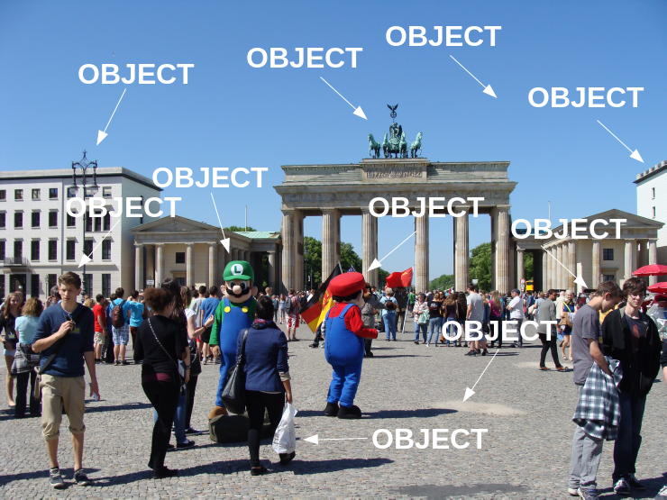
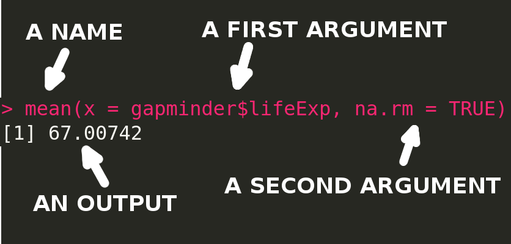
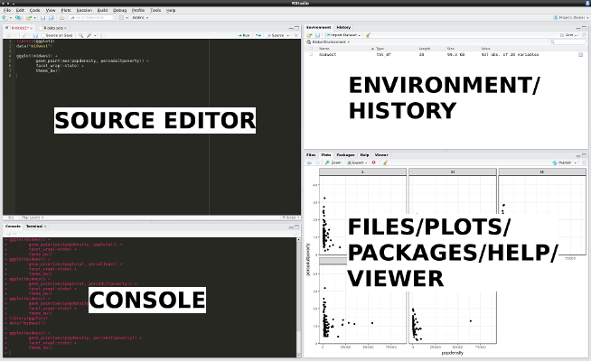
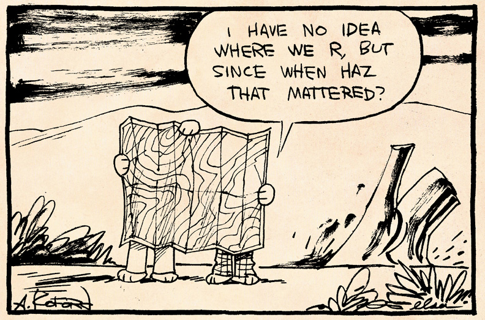
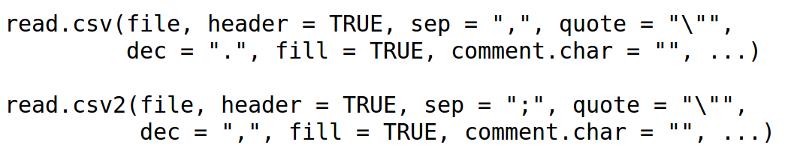
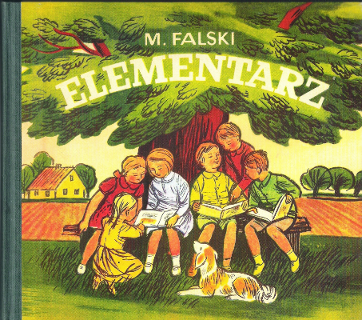
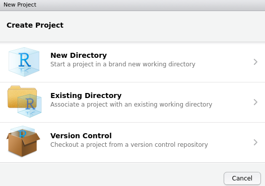

[](https://www.flickr.com/photos/38463026@N04/7432529536/)

```{r setup, include=FALSE}
library(knitr)
options(htmltools.dir.version = FALSE)
```

## Everything in R is an object




---
## Assignment operator

`<-` assigns a value to an object

```{r}
x <- 2
x
x + 3
y <- x + 3
y
```

---
## Combine values

`c()` combines its arguments (elements) to a one object

```{r}
c(1, 2, 3)
```

```{r}
x <- c(1, 2, 3)
x
```

```{r}
y <- x * 2
y
```

---
## What does function do?



---
## Object?

```{r}
2 + 2
```

```{r}
x <- 2
x + x
```

```{r}
x <- 2
y <- x + x
y
```

```{r}
x <- 2
x <- x + x
x
```

---
## Why do I need a package?
- As of March 2017, there were over 10,000 packages on the official repository (Comprehensive R Archive Network - CRAN)
- A package is a group of functions
- `install.packages()` can be used to install packages from CRAN:

```{r, eval=FALSE}
install.packages('ggplot2')
```

- You only need to install a package once!
- `update.packages()` can be used to update installed packages

```{r, eval=FALSE}
update.packages()
```

- To use a package, load it with function `library()`
- Unlike `install.packages()`, you need to load selected packages everytime you run R!

```{r}
library('ggplot2')
```

---
## Where am I? - Working directory

- Working directory is the current working directory (location on a hard drive) of the R process
- Function `getwd()` returns an absolute filepath representing the current working directory:

```{r}
getwd()
```

- Working directory can be changed using **Ctrl+Shift+H** shortcut in RStudio (alternatively Session -> Set Working Directory -> Choose Directory...) or a function `setwd()`:

```{r, eval=FALSE}
setwd("home/jn/Documents/Intro_to_R/")
```

- ...in Windows:

```{r, eval=FALSE}
setwd("C:/Users/jn/Documenty/Intro_to_R/")
```

---
## Quo Vadis

- Working directory is important, because it is allows to use a relative filepath
- In most of the cases, the use of a relative filepath is recommended. It simplifies work, especially when data and code are moved between computers
- Relative filepath *"data/file.rds"*

```{r, eval=FALSE}
gap <- readRDS("data/gapminder.rds")
```

- Absolute filepath *"home/jn/Documents/Intro_to_R/data/file.rds"*
```{r, eval=FALSE}
gap <- readRDS("/home/jn/Documents/Intro_to_R/data/gapminder.rds")
```

- ...in Windows:
```{r, eval=FALSE}
gap <- readRDS("C:/Users/jn/Documents/Intro_to_R/data/gapminder.rds")
```

---
## R
- https://www.r-project.org/
- http://cran.rstudio.com/bin/linux/
- http://cran.rstudio.com/bin/windows/base/
- http://cran.rstudio.com/bin/macosx/

  

---
## RStudio
- http://www.rstudio.com/ide/download/desktop
- This is an Integrated Development Environment (IDE) for R
- RStudio have many useful features, such as text editor, syntax highlighting, suggested code auto-completion, and many more



---
## Keyboard shortcut

- **Alt+Shift+K** - show keyboard shortcut reference
- **Ctrl+Enter** - run current line/selection
- **Alt+-** - insert assignment operator <- 
- **Tab** - attempt completion	
- **F1** - show help for function at cursor
- **Ctrl+Shift+C** - comment/uncomment current line/selection
- **Up/Down** (in a console) - navigate candidates
- **Ctrl+Shift+H** - change working directory
- **Esc** - interrupt currently executing command

---
## Help me!


###### https://www.flickr.com/photos/apelad/6845309733]

---
## Help in R

```{r, eval=FALSE}
# if you know a function name
?mean

# if you know what you want to do
??"anova"
```

- You can also look for help using the Help window or **F1** key

## Online help
- [stackoverflow.com](http://stackoverflow.com/questions/tagged/r)
- [RDocumentation](http://www.rdocumentation.org/)
- [twitter](http://twitter.com/) - #rstats
- Web search engines [Rseek](http://www.rseek.org/), [Duckduckgo](http://duckduckgo.com/), [Google](http://google.com/), [Bing](http://bing.com/), etc.


---
## R wants data!


###### https://www.flickr.com/photos/shellewill79/5333263261/

---
## CSV data

- Reading data

```{r, eval=FALSE}
skoki2013 <- read.csv2("data/skijumps.csv")
skoki2013 <- read.csv("data/skijumps.csv")
```



- Writing data

```{r, eval=FALSE}
write.csv(skoki2013, file="data/skijumps_csv.csv")
write.csv2(skoki2013, file="data/skijumps_csv.csv")
```

---
## RData format

- Loading data

```{r, eval=FALSE}
load("data/temperature.RData")
```

- Saving data

```{r, eval=FALSE}
save(my_object, file="data/new_temperature.RData")
```

---
## RDS format

- Loading a data

```{r, eval=FALSE}
gap <- readRDS("data/gapminder.rds")
```

- Saving a data

```{r, eval=FALSE}
saveRDS(gap, file="data/new_gapminder.rds")
```

---
## Data from R packages

- Loading a data

```{r}
#install.packages('ggplot2')
library('ggplot2')
data("midwest")
midwest
```

---
## My object is realy classy


###### http://littlebritain.wikia.com/wiki/File:Emily_Howard_(1).jpg

---
## Object classes
- There are many classes in R
- Everybody can create a new class in R!
- Some function works only with object of some class
- There are four basic classes in R:
    - Vector
    - Matrix
    - Data frame
    - List

---
## Vector

- A vector is the simpliest R object class 
- A vector can be created using `c()` function

```{r}
vector_text <- c("cat", "dog")
vector_logical <- c(TRUE, FALSE)
vector_numeric <- c(1, 2.35)
vector_mixed <- c("kot", 2.35)
```

---
## Vector

```{r}
vector_text <- c("cat", "dog")
vector_logical <- c(TRUE, FALSE)
vector_numeric <- c(1, 2.35)
vector_mixed <- c("kot", 2.35)
```

```{r}
class(vector_text)

class(vector_logical)

class(vector_numeric)

class(vector_mixed)
```

---
## Data frame

- A data frame is the most often used object class in R
- Simple data frames resembles a table with rows (observations) and columns (variables)
- A data frame can be also created by reading external files (such as .csv)

```{r}
df <- data.frame(texts=c("cat", "dog"),
           logicals=c(TRUE, FALSE),
           numerics=c(1, 2.35))
df
```

---
## Data types

```{r}
type_text <- "dog"
type_logical <- TRUE
type_numeric <- 1.23
type_factor <- as.factor("dog")
```

```{r}
class(type_text)
class(type_logical)
class(type_numeric)
class(type_factor)
```

---
## Data types - factors

```{r}
type_text2 <- c("dog", "cat", "mouse", "dog")
type_text2
class(type_text2)
```

```{r}
type_factor2 <- as.factor(c("dog", "cat", "mouse", "dog"))
type_factor2
class(type_factor2)
```

---
## My first words

```{r, echo=FALSE}

```

---
## My first words

```{r}
# install.packages('gapminder')
library('gapminder')
data("gapminder")
```

- The `str()` function displays the structure of an R object. It returns, for example, a class of an object, number of observations (rows), number of variables (columns), names of variables, types of variables, and first few values

```{r}
str(gapminder)
```

---
## My first words

- The `head()` function returns the first part of an object (default - a six first observations/rows)

```{r}
head(gapminder)
```

---
## My first words

- The `summary()` function displays summaries of the results
- This summary depends on a type of variable, for example a minimum, first quartile, median, mean, third quartile, and maximum is returned for numerical variables and a number of observation is returned for factor variables

```{r}
summary(gapminder)
```

---
## How to start?


###### https://www.flickr.com/photos/cogdog/5528772562


---
## How to start?

Create a new RStudio project:



- All the files in a one place (**integrity**)
- Easy to move between computers (**portability**)
- Integration with version control systems - git and svn (**shareability**)

---
## How to start?

Project' structure (starting point):

```{r, engine='bash', eval = FALSE}
project/
  - README.Rmd # Project description
  - R/         # For R code
      - 01_data_download.R
      - 02_data_processing.R
      - 03_plots.R
  - data/      # Preprocessed data
      - water_quality_cleaned.rds
      - landcover_wgs84.tif
  - raw_data/  # Original data
      - water_quality.csv
      - landcover.tif
  - text/      # Description of the results + figures
      - water_quality.tex
      - figs/
          - 01_study_area.png
          - 02_boxplots.png
```


---
## What's next?

<!--https://blog.datazar.com/the-5-most-effective-ways-to-learn-r-d4cfdf0d524 -->

- [R news and tutorials contributed by R bloggers](https://www.r-bloggers.com/) - a blog aggregator
- [RStudio Cheat Sheets](https://www.rstudio.com/resources/cheatsheets/) - various cheer sheets - from data import/export to specific applications
- [R for cats](https://rforcats.net/) - meow...
- [try R](http://tryr.codeschool.com/) - a gentle interactive introduction to R
- [introducing R to a non-programmer in one hour](http://alyssafrazee.com/introducing-R.html) - it's possible!
- [R for Data Science](http://r4ds.had.co.nz/) - a great book which contains chapters for beginners and for more advanced users
- [Efficient R programming](https://csgillespie.github.io/efficientR/) - aka how to be more efficient working with R
- [R is for archaeology](https://electricarchaeology.ca/2017/04/11/r-is-for-archaeology-a-report-on-the-2017-society-of-american-archaeology-meeting-by-b-marwick/) - R is not only used by statisticians
- [60+ R resources to improve your data skills](http://www.computerworld.com/article/2497464/business-intelligence/business-intelligence-60-r-resources-to-improve-your-data-skills.html) - a way longer list of great resources