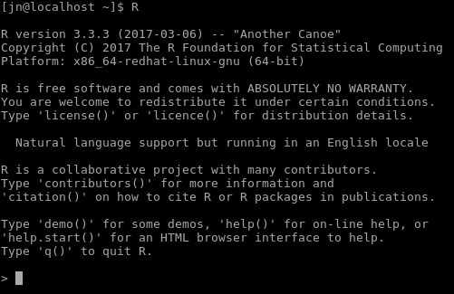

```{r setup, include=FALSE}
options(htmltools.dir.version = FALSE)
```

## Object

- Everything in R is an object


<!--
Moje pierwsze kroki

<center>

</center>
-->

---
## Assignment operator

*<-* assigns a value to an object

```{r}
x <- 2
x
x + 3
y <- x + 3
y
```

---
## Combine values

*c()* combines its arguments (elements) to a one object

```{r}
c(1, 2, 3)
```

```{r}
x <- c(1, 2, 3)
x
```

```{r}
y <- x * 2
y
```

---
## What does function do?


---
## Object?

```{r}
2 + 2
```

```{r}
x <- 2
x + x
```

```{r}
x <- 2
y <- x + x
y
```

```{r}
x <- 2
x <- x + x
x
```

---
## Why do I need a package?
- As of March 2017, there were over 10,000 packages on the official repository (Comprehensive R Archive Network - CRAN)
- A package is a group of functions
- *install.packages()* function can be used to install packages from CRAN:

```{r, eval=FALSE}
install.packages('ggplot2')
```

- You only need to install a package once!
- *update.packages()* function can be use to update installed packages

```{r, eval=FALSE}
update.packages()
```

- To use a package, load it with function *library()*
- Unlike *install.packages()*, you need to load selected packages everytime you run R!

```{r}
library('ggplot2')
```

---
## Where am I? - Working directory

- Working directory is the current working directory (location on a hard drive) of the R process
- Function *getwd()* returns an absolute filepath representing the current working directory:

```{r}
getwd()
```

- Working directory can be change using **Ctrl+Shift+H** shortcut in RStudio (alternatively Session -> Set Working Directory -> Choose Directory...) or a function *setwd()*:

```{r, eval=FALSE}
setwd("home/jakub/Documents/rope/")
```

- ...in Windows:

```{r, eval=FALSE}
setwd("C:/Users/jakub/Documenty/rope/")
```

---
## Quo Vadis

- Working directory is important, because it is allows to use a relative filepath
- In most of the cases, the use of a relative filepath is recommended It simplified work, when data and code are moved between computers
- Relative filepath, *"data/plik.rds"*

```{r, eval=FALSE}
gap <- readRDS("data/gapminder.rds")
```

- Absolute filepath *"home/jakub/Documents/rope/data/plik.rds"*
```{r, eval=FALSE}
gap <- readRDS("/home/jakub/Documents/rope/data/gapminder.rds")
```

- ...in Windows:
```{r, eval=FALSE}
gap <- readRDS("C:/Users/jakub/Documents/rope/data/gapminder.rds")
```

---
## R
- https://www.r-project.org/
- http://cran.rstudio.com/bin/linux/
- http://cran.rstudio.com/bin/windows/base/
- http://cran.rstudio.com/bin/macosx/

  

---     
## RStudio
- http://www.rstudio.com/ide/download/desktop
- This is an Integrated Development Environment (IDE) for R
- RStudio got many useful features, such as text editor, syntax highlighting, suggested code auto-completion, and many more


---
## Keyboard shortcut

- **Alt+Shift+K** - show keyboard shortcut reference
- **Ctrl+Enter** - run current line/selection
- **Alt+-** - insert assignment operator <- 
- **Tab** - attempt completion	
- **F1** - show help for function at cursor
- **Ctrl+Shift+C** - comment/uncomment current line/selection
- **Up/Down** (in a console) - navigate candidates
- **Ctrl+Shift+H** - change working directory
- **Esc** - interrupt currently executing command

---
## Help me!


---
## Help in R

```{r, eval=FALSE}
# if you know a function name
?mean

# if you know what you want to do
??"anova"
```

- You can also look for help using the Help window or **F1** key

## Online help
- [stackoverflow.com](http://stackoverflow.com/questions/tagged/r)
- [RDocumentation](http://www.rdocumentation.org/)
- Web search engines [Rseek](http://www.rseek.org/), [Duckduckgo](http://duckduckgo.com/), [Google](http://google.com/), [Bing](http://bing.com/), etc.

---
## R want data!


---
## CSV data

- Reading a data

```{r, eval=FALSE}
skoki2013 <- read.csv2("data/skijumps.csv")
skoki2013 <- read.csv("data/skijumps.csv")
```


- Writing a data

```{r, eval=FALSE}
write.csv(skoki2013, file="data/skijumps_csv.csv")
write.csv2(skoki2013, file="data/skijumps_csv.csv")
```

---
## RData format

- Loading a data

```{r, eval=FALSE}
load("data/temperature.RData")
```

- Saving a data

```{r, eval=FALSE}
save(my_object, file="data/new_temperature.RData")
```

---
## RDS format

- Loading a data

```{r, eval=FALSE}
gap <- readRDS("data/gapminder.rds")
```

- Saving a data

```{r, eval=FALSE}
saveRDS(gap, file="data/new_gapminder.rds")
```

---
## Data from R packages

- Loading a data

```{r}
#install.packages('ggplot2')
library('ggplot2')
data("economics")
economics
```

---
## My object is very classy


---
## Object classes
- There are many classes in R
- Everybody can create a new class in R!
- Some function works only with object of some class
- There are four basic classes in R:
    - Vector
    - Matrix
    - Data frame
    - List

---
## Vector

- A vektor is the simpliest R object class 
- A vector can be created using *c()* function

```{r}
vector_text <- c("cat", "dog")
vector_logical <- c(TRUE, FALSE)
vector_numeric <- c(1, 2.35)
vector_mixed <- c("kot", 2.35)
```

---
## Vector

```{r}
vector_text <- c("cat", "dog")
vector_logical <- c(TRUE, FALSE)
vector_numeric <- c(1, 2.35)
vector_mixed <- c("kot", 2.35)
```

```{r}
class(vector_text)

class(vector_logical)

class(vector_numeric)

class(vector_mixed)
```

---
## Data frame

- A data frame is the most often used object class in R
- Simple data frames resemble a table with rows (observations) and columns (variables)
- A data frame can be also created by reading external files (such as .csv)

```{r}
df <- data.frame(texts=c("cat", "dog"),
           logicals=c(TRUE, FALSE),
           numerics=c(1, 2.35))
df
```

---
## Data types

```{r}
type_text <- "dog"
type_logical <- TRUE
type_numeric <- 1.23
type_factor <- as.factor("dog")
```

```{r}
class(type_text)
class(type_logical)
class(type_numeric)
class(type_factor)
```

---
## Data types - factors

```{r}
type_text2 <- c("dog", "cat", "mouse", "dog")
type_text2
class(type_text2)
```

```{r}
type_factor2 <- as.factor(c("dog", "cat", "mouse", "dog"))
type_factor2
class(type_factor2)
```

---
## Moje pierwsze słowa


---
## Moje pierwsze słowa

```{r}
# install.packages('gapminder')
library('gapminder')
data("gapminder")
```

- Funkcja *str()* wyświetla strukturę obiektu, w tym np. klasę obiektu, liczbę obserwacji (wierszy), liczbę zmiennych (kolumn), nazwy zmiennych, typ zmiennych oraz przykładowe wartości 

```{r}
str(gapminder)
```

---
## Moje pierwsze słowa

- Funkcja *head()* domyślnie zwraca sześć pierwszych obserwacji (wierszy) w ramce danych

```{r}
head(gapminder)
```

---
## Moje pierwsze słowa

- Funkcja *summary()* wyświetla podsumowanie numeryczne 
- Podsumownie numeryczne zależy od typu zmiennej, np. dla zmiennych liczbowych jest to wartość minimalna, pierwszy kwartyl, mediana, średnia, trzeci kwartyl oraz wartość maksymalna a dla zmiennych czynnikowych to liczba obserwacji w danym poziomie

```{r}
summary(gapminder)
```

---
## What's next?

<video src="fig/video.webm" controls autoplay="true" loop="loop">
</video>

---
## What's next?
1. [Beginner's guide to R: Introduction](http://www.computerworld.com/article/2497143/business-intelligence/business-intelligence-beginner-s-guide-to-r-introduction.html)
2. [A (very) short introduction to R](references/Torfs+Brauer-Short-R-Intro.pdf)
3. [Introduction to R](references/Introduction_to_R.pdf)
4. [R - First Steps](references/R-firststeps.pdf)
5. [An intro to R for new programmers](http://rforcats.net/)
6. [introducing R to a non-programmer in one hour ](http://alyssafrazee.com/introducing-R.html)
7. [Try R](http://tryr.codeschool.com/)
8. [60+ R resources to improve your data skills](http://www.computerworld.com/article/2497464/business-intelligence/business-intelligence-60-r-resources-to-improve-your-data-skills.html)